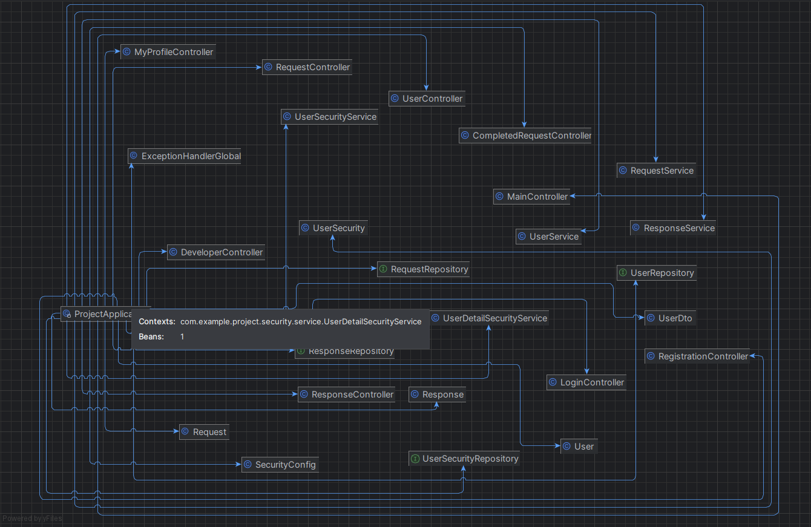
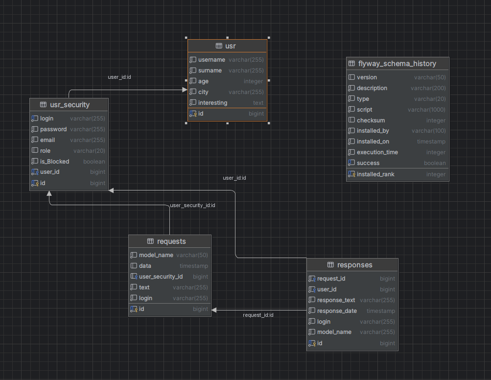

### Представляю свой проект по теме автоматизированная система в сфере ремонта бытовой техники
#### Проект полностью написан на языке java с использованием популярного фреймворка spring boot версии 3.2.5
#### spring boot - это это фреймворк для разработки приложений на языке Java, который помогает упростить процесс создания и настройки приложений. Он предоставляет множество готовых инструментов и функций, которые делают разработку проще и быстрее. Spring Boot также упрощает конфигурирование приложений и автоматически управляет зависимостями, что позволяет разработчикам сосредоточиться на самом коде приложения.

### Основные требования по проекту:
1) Требования к аппаратному  обеспечению
 - Windows 7+/MacOS 13+/Linux9+;
 - Оперативная   память 8 гб+;
 - Свободное место на диске 250 гб+
2) Требования к программному обеспечению
 - СУБД PostgreSQL 9.2-9.5;
 - Java Development Kit 17;
 - серевер Tomcat 10+
 - Maven 3+
3) Использование библиотек
 - Lombok
 - Spring Web
 - Spring Security
 - Spring Validation
 - Spring Thymeleaf
 - Driver postgres
 - Tomcat
 - Spring Data JPA
4) Использования front-end файлы
 - Java-script
 - html
 - css
5) Использования SQL запросов и миграция баз данных
 - Transaction
 - FlyWay
 - Database postgresql
 - CRUD операции
6) Функциональность для spring Security
 - Аутентификация и авторизация пользователей
 - Разграничение прав доступа к ресурсам
 - Шифрование паролей пользователей
 - Логирование действий пользователей
### Для запуска проекта 
1) Надо иметь IntelliJ IDEA 2023.2.5
2) Postgresql
3) Browser Chrome

### Иерархия-классов проекта

>Начне с самого главного мой проект работает на MVC приложение Model-View-Controller
1) Controller 
>В моем проекте есть 2 папки controller, они отличаются тем, что одна папка создана для securty в данном случае это регистрация и авторизация 
> """
> 
    @Autowired
    public RegistrationController(UserSecurityService userSecurityService) {
        this.userSecurityService = userSecurityService;
    }

    @GetMapping("/register")
    public String showRegistrationForm(Model model) {
        model.addAttribute("userDto", new UserDto());
        return "register";
    }

    @PostMapping("/register")
    public String registerUser(@Valid @ModelAttribute("userDto") UserDto userDto, BindingResult result) {
        if (result.hasErrors()) {
            return "register";
        }

        userSecurityService.registeredUser(userDto);

        return "redirect:/login-user";
    }
"""
>Здесь я показал маленький код для контроллера RegistrationController, суть это контроллера заключается в следующем 
> 
>Метод showRegistrationForm обрабатывает GET запрос на страницу регистрации и добавляет модель UserDto в атрибуты, чтобы передать ее на страницу register.html для отображения формы регистрации.
> 
>Метод registerUser обрабатывает POST запрос с данными, отправленными со страницы регистрации.
> 
>Аннотация @Valid используется для валидации данных, переданных с формы (UserDto), согласно правилам, определенным в классе UserDto.
BindingResult содержит результаты валидации данных, и если есть ошибки, метод возвращает страницу регистрации с сообщениями об ошибках.
Если данные прошли валидацию успешно, выполняется метод registeredUser из сервиса userSecurityService для регистрации нового пользователя на основе данных из UserDto.
После успешной регистрации, метод возвращает redirect на страницу для входа пользователя.
Таким образом, данный контроллер обрабатывает запросы связанные с регистрацией новых пользователей, валидирует данные, регистрирует нового пользователя и перенаправляет пользователя на страницу входа.
> 
> 
> Далее расскажи как просиходит регистрация пользователя в сервисе 
> 
> В сервисе UserSecurityService для регистрации пользователя вызывается метод registeredUser, который принимает на вход объект UserDto, содержащий информацию о новом пользователе (логин, пароль, email, имя, фамилия, возраст, город, интересы).
>
>В начале метода происходит проверка наличия пользователя с таким же логином в базе данных. Если пользователь с таким логином уже существует, то выбрасывается исключение SameUserInDatabase.
>
>Затем создается объект User и заполняется информацией о пользователе из UserDto. Этот объект сохраняется в репозитории UserRepository, чтобы получить уникальный идентификатор (id) пользователя.

>Далее создается объект UserSecurity и заполняется информацией о пользователе из UserDto, а также устанавливается хешированный пароль с помощью PasswordEncoder. Роль пользователя устанавливается в Roles.MODERATION. Уникальный идентификатор пользователя (user_id) устанавливается в соответствии с id пользователя, сохраненного в репозитории UserRepository.

>И наконец, объект UserSecurity сохраняется в репозитории UserSecurityRepository, завершая процесс регистрации нового пользователя.

>Таким образом, при вызове метода registeredUser происходит создание записей о новом пользователе как в репозитории UserRepository, так и в репозитории UserSecurityRepository, обеспечивая его доступ к системе с уникальными данными и защищенным паролем.
> 
```java
     @Transactional(rollbackFor = Exception.class)
public void registeredUser(UserDto userDto){
        Optional<UserSecurity> security = userSecurityRepository.findByLogin(userDto.getLogin());
        if (security.isPresent()) {
        throw new SameUserInDatabase(userDto.getLogin());
        }

        User user = new User();
        user.setUsername(userDto.getUsername());
        user.setSurname(userDto.getSurname());
        user.setAge(userDto.getAge());
        user.setCity(userDto.getCity());
        user.setInteresting(userDto.getInteresting());
        User savedUser = userRepository.save(user);

        UserSecurity userSecurity = new UserSecurity();
        userSecurity.setLogin(userDto.getLogin());
        userSecurity.setPassword(passwordEncoder.encode(userDto.getPassword()));
        userSecurity.setEmail(userDto.getEmail());
        userSecurity.setRole(Roles.MODERATION);
        userSecurity.setUser_id(savedUser.getId());
        userSecurityRepository.save(userSecurity);
        }
 ```
>Также можно увидеть как создаются модельки для базы данных
> 
```java

package com.example.project.model; 
import jakarta.persistence.Column;
import jakarta.persistence.Entity;
import jakarta.persistence.GeneratedValue;
import jakarta.persistence.Id;
import jakarta.persistence.SequenceGenerator;
import jakarta.persistence.Temporal;
import jakarta.persistence.TemporalType;
import lombok.AllArgsConstructor;
import lombok.Data;
import lombok.NoArgsConstructor;
import org.springframework.stereotype.Component;

import java.sql.Timestamp;

@Data
@NoArgsConstructor
@AllArgsConstructor
@Component
@Entity(name = "responses")
public class Response {
@Id
@SequenceGenerator(name = "ResGenSeq",sequenceName = "responses_id_seq", allocationSize = 1)
@GeneratedValue(generator = "ResGenSeq")
private Long id;
@Column(name = "request_id")
private Long request_id;
@Column(name = "user_id")
private Long user_security_id;
@Column(name = "response_text")
private String response_text;
@Column(name = "response_date")
@Temporal(TemporalType.TIMESTAMP)
private Timestamp response_date;
@Column(name = "login")
private String login;
@Column(name = "model_name")
private String model_name;
}
```

### Иерархия классов базы данных

> Здесь также есть отдельная таблица от плагина flyway, которая при подключении к проекту автоматически создает эту таблицу, чтобы в будущем отслеживать кто какие изменения внес в базу данных


